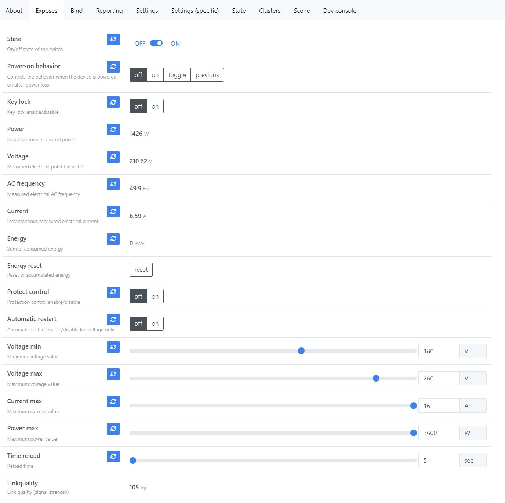

# <a id="Top">Tuya Plug with power monitoring with custom firmware</a>

### Custom firmware for Tuya Plug models

- _TZ3000_w0qqde0g
- _TZ3000_gjnozsaz
- _TZ3000_zloso4jk

[Repository tuya_plug_ts011f_zrd](https://github.com/slacky1965/tuya_plug_ts011f_zrd)

---


**Автор не несет никакой ответственности, если вы, воспользовавшись этим проектом, превратите свою умную розетку в полоумную.**

Если у вас другая сигнатура, лучше не заливать, не проверив на совпадение используемого чипа и GPIO, ну или хотя бы визуально проверить, что платы одинаковые.

## Зачем. 

Да большой необходимости не было, просто как раз закончил [проект с умным реле](https://github.com/slacky1965/tuya_mini_relay_zrd), а розетка оказалась выполнена по похожей схеме. Так сказать заодно.

## Что получилось. 

**About**


---

## <a id="settings">Настройка</a>

**Вкладка `Exposes`**



- `State` - выводит текущее состояние розетки.
- `Power-on behavior` - настраивает в какой режим переходит розетка при подаче питания.
- `Key lock` - блокирует кнопку на корпусе устройства. Включить/выключить блокировку можно только удаленно.
- `Power` - выводит текущее значение мощности.
- `Voltage` - выводит текущее значение напряжения.
- `AC frequency` - выводит текущее значение частоты.
- `Current` - выводит текущее значение силы тока.
- `Energy` - выводит текущее значение накопленной энергии.
- `Energy reset` - сбросить на 0 текущее значение накопленной энергии.
- `Protect control` - включение контроля перегрузки по напряжению, току или мощности.
- `Automatic restart` - включение нагрузки после устранения перегрузки (если до перегрузки розетка была включена). Работает только для напряжения.
- `Voltage min` - минимально допустимое напряжение. Если напряжение становится ниже этого параметра и `Protect control` включен, то нагрузка отключается. Если установлено в 0, то ограничение отключено.
- `Voltage max` - максимально допустимое напряжение. Если напряжение становится выше этого параметра и `Protect control` включен, то нагрузка отключается. Если установлено в 0, то ограничение отключено.
- `Current max` - максимально допустимый ток. Если ток становится выше этого параметра и `Protect control` включен, то нагрузка отключается. Максимальное значени 16А. Если установлено в 0, то ограничение отключено.
- `Power max` - максимально допустимая мощность. Если мощность становится выше этого параметра и `Protect control` включен, то нагрузка отключается. Максимальное значени 3600W. Если установлено в 0, то ограничение отключено.
- `Time reload` - время в секундах от 5 до 60 через которое произойдет попытка повторого включения после перегрузки по напряжени. Включение происходит только в том случае, если напряжение находится в пределах, между `Voltage min` и `Voltage max`.

---

**Вкладка `Reporting`**


Настройка репортинга.

Репортинг кластера `OnOff` лучше не трогать.

Репортинг остальных параметров можно настроить в соответствии с вашими желаниями. 

---

Немного про запись накопленной энергии. Были жалобы, что такие розетки часто просто так мрут. Считывание параметров сети происходит раз в секунду. Есть подозрение, что накопленную энергию они сохраняют в одно и тоже место. В этой прошивке применен другой метод. С адреса 0x96000 по адрес 0xFC000 находится неиспользуемое пространство (Reserved Area. см. [drv_nv.h](tl_zigbee_sdk/proj/drivers/drv_nv.h) для прошивок без бутлоадера). Размер этой области составляет 0x66000 (417792 байт). Запись происходит каждый раз в новое место с шагом 256 байт. Итого мы имеем 1632 сегмента для записи. Запись происходит по кругу. Запись осуществляется по изменению параметра накопленной энергии, но не чаще 1 раза в минуту.

---

Подключение к сети происходит при длительном удержании кнопки на самом розетке.

---

## Как обновить.

Сначала нужно скопировать два конвертора из репозитория [tuya_plug_ts011f_orig.js](zigbee2mqtt/converters/tuya_plug_ts011f_orig.js) и [ts011f_plug-sld.js](zigbee2mqtt/converters/ts011f_plug-sld.js) в папку `zigbee2mqtt/external_converters`.

Далее нужно добавить локальное хранилище обновлений. 

Создаем директорию `images` в директории z2m и кладем туда файл [1141-d3a3-1111114b-tuya_plug_ts011f_zrd.zigbee](bin/1141-d3a3-1111114b-tuya_plug_ts011f_zrd.zigbee).

Копируем в директорию z2m файл [local_ota_index.json](zigbee2mqtt/local_ota_index.json)

В конфиг z2m `configuration.yaml` добавляем локальное хранилище

```
ota:
  zigbee_ota_override_index_location: local_ota_index.json
```

Далее перегружаем z2m. И видим у нас новое устройство.


Далее идем в раздел OTA. И видим там свое устройство. Жмем проверить обновления. 


Жмем на появившуюся красную кнопку. И обновляемся.


Если все не так, как описано, значит вы что-то сделали не по инструкции (не положили файл куда нужно, не перегрузили z2m) или сигнатуры вашей розетки нет в списке поддерживаемых устройств.

> [!WARNING]
> Внимание!!! Если в процессе вы обнаружите на каких-то устройствах Туя, которые возможно у вас есть еще в системе, новое обновление, то обновлять ничего не нужно!!! Иначе вы зальете в это устройство прошивку от розетки и получите кирпич!!! Если же процесс обновления по ошибке уже начался, то просто обесточьте это устройство!!!

Далее ждем окончания.

После окончания обновления, если розетка в визуальной доступности, она начнет моргать светодиодом. В этот момент нужно разрешить добавление новых устройств в `zigbee2mqtt`, после чего розетка присоединиться к сети с новым адресом. Нам останется только принудительно удалить предыдущую копию розетки.

---

P.S. Как еще можно понять, что Ваша розетка подходит к этой прошивке. Нужно открутить крепежный саморез (он спрятан под наклейкой). У него хитрый шлиц, но простой плоский шлиц у отвертки, подобранный по размеру, спокойно его откручивает.


Далее снимаем крышку с наклейкой и видим плату. Если она такая же, как на фото ниже, то обновить розетку можно. Если там что-то другое, то лучше не рисковать.


---

Связаться со мной можно в **[Telegram](https://t.me/slacky1965)**.

### Если захотите отблагодарить автора, то это можно сделать через [ЮMoney](https://yoomoney.ru/to/4100118300223495)

---

## История версий
- 1.0.01
	- Начало.
